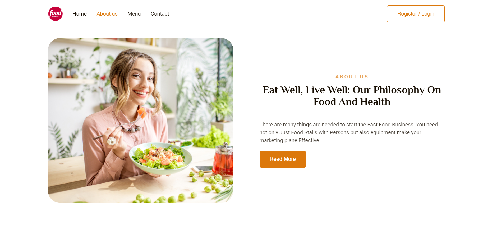
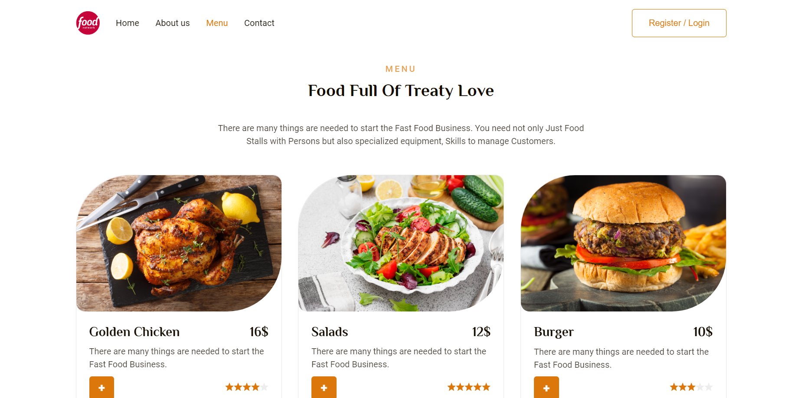
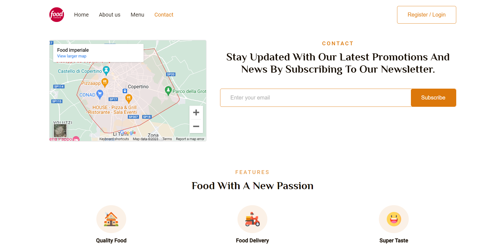

# Food Network

Food Network is a website where you can explore and order a variety of delicious dishes. This project is built using React with functional components, hooks, and the react-router-dom library. The site is fully responsive and features a mobile-friendly burger menu for smaller screens.

## Features

- Navigation through different sections of the website: Home, About Us, Menu, Contact.
- View a diverse menu and load more dishes to explore additional options.
- Smooth animations using the AOS (Animate On Scroll) library.
- Responsive design for various screen sizes.
- Burger menu for easy navigation on smaller screens.

## Tech Stack

- React
- Functional Components, Hooks
- React Router DOM
- AOS (Animate On Scroll)
- SCSS 

## Access the App

You can access the application at the following link: [Food Network](https://nataly-horbunova.github.io/food_network/)

## Screenshots

_Home_

_About us_

_Menu_

_Contact_

## Get Started

1. Clone repository
2. Install dependencies: `npm install`
3. Start: `npm start`

